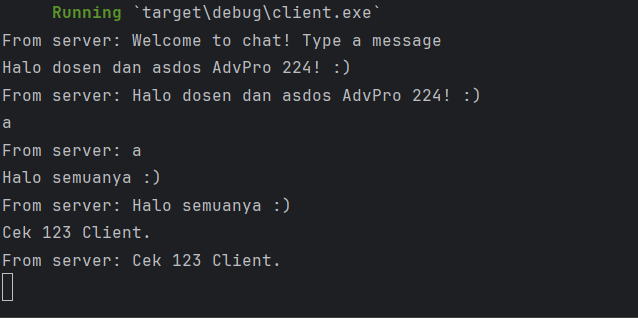
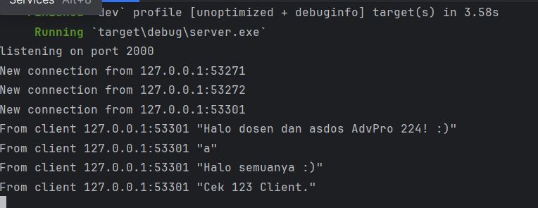

<h1>Reflection 1</h1>
<h3>This is the way</h3>
 Once the server is started using the command cargo run --bin server and each client is run using cargo run --bin client. Every client along with the server, receives chat broadcasts from each other client. Whenever a client enters a message into the command line, that text is forwarded to the server, which then redistributes it to all clients that are connected. 

  

  