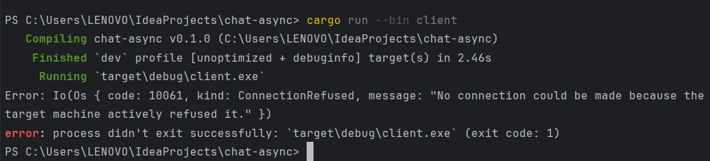
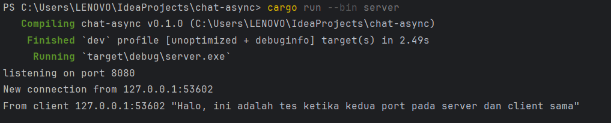
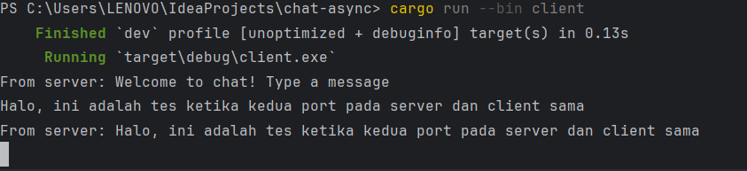
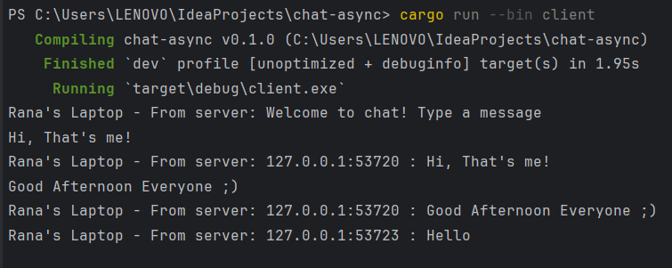
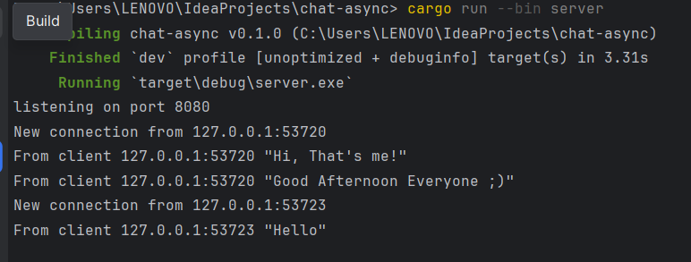

<h1>Reflection 1</h1>
<h3>This is the way</h3>
 Once the server is started using the command cargo run --bin server and each client is run using cargo run --bin client. Every client along with the server, receives chat broadcasts from each other client. Whenever a client enters a message into the command line, that text is forwarded to the server, which then redistributes it to all clients that are connected. 

  

  

<h1>Reflection 2</h1>
<h3>What happens when we modify the port?</h3>

1. On different ports
 When attempting to establish a network connection, both the client and the server use specific port numbers to listen for and send data. If the client tries to connect to a server on a port that the server is not listening to, the server will not respond to the connection request, leading to a rejection. This is because each port may be configured to handle specific tasks or services, and if there is no service running on the mentioned port, the server will not accept any incoming connections on that port. 

2. On the same port
 When the client and server are configured to communicate over the same port, the connection can be established without issues. This means the client targets the correct port where the server is listening for incoming requests. Ports are integral to determining what process network traffic should be directed to, so having the client and server on the same port ensures that the data is sent to and received by the intended processes, allowing for successful communication. 
  

<h1>Reflection 3</h1>
<h3>This is the way</h3>
 The change is made so that when `bcast.tx` (which is the sender) sends a message to each subscriber it will also provide the sender IP of the text through the addr variable. 

